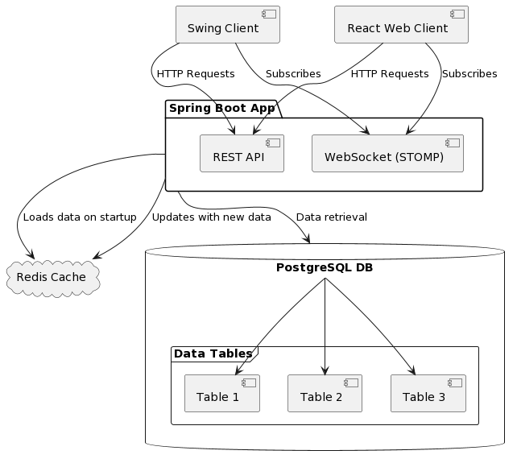
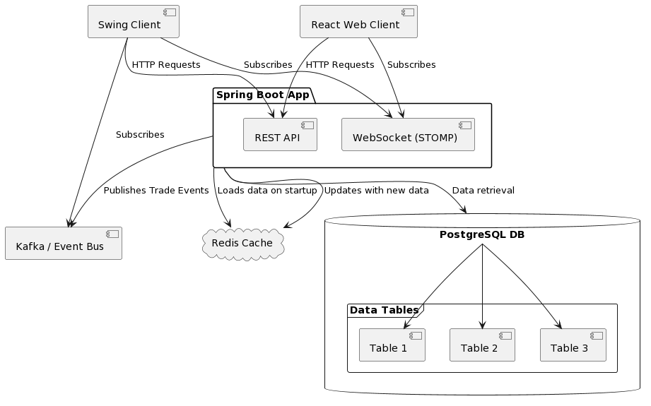

#### Components:

- **Spring Boot App**
    - REST API: Handles HTTP requests
    - WebSocket (STOMP): Provides WebSocket support

- **Redis Cache**
    - Loads data on server start
    - Updates with new data from DB

- **PostgreSQL DB**
    - Stores application data

- **Swing Client**
    - Calls REST API
    - Receives messages over WebSocket (STOMP)
    - Utilizes an Event Bus or Kafka client for handling events

- **React Web Client**
    - Utilizes StompJs for WebSocket support

### Sequence Diagram

```sequence
Swing Client->Spring Boot App: HTTP Request
Spring Boot App->PostgreSQL DB: Query DB
PostgreSQL DB-->Spring Boot App: Query Result
Spring Boot App-->Swing Client: Response
```


